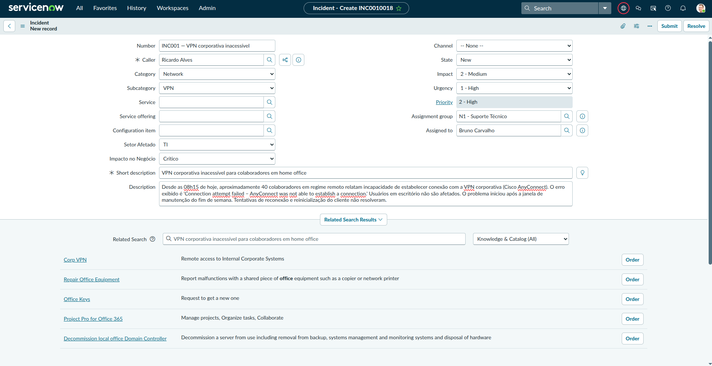
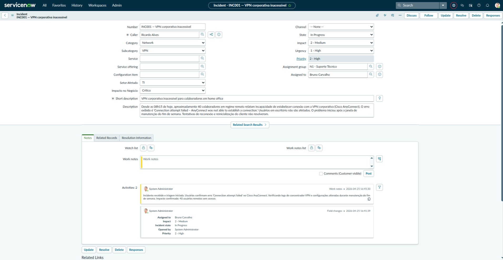
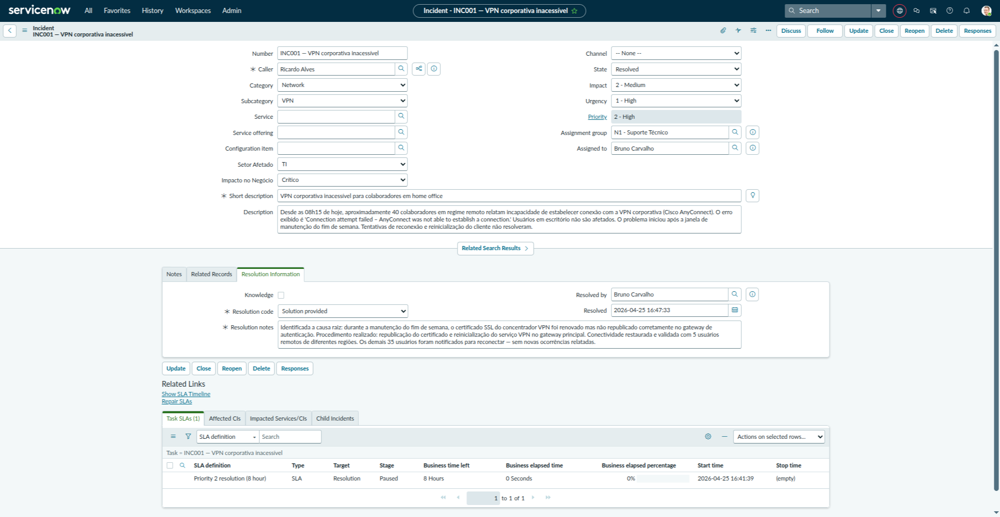
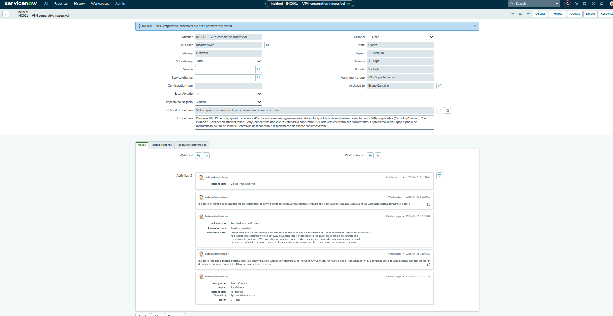

# Entregável — Ciclo de Vida Completo do Incidente

**Semana:** 1 — Fundamentos
**Instância:** PDI ServiceNow (versão Australia)
**Data:** Abril 2026
**Incidente:** INC001 — VPN corporativa inacessível para colaboradores em home office

---

## Objetivo

Demonstrar o ciclo de vida completo de um incidente no ServiceNow,
avançando manualmente pelos estados New → In Progress → Resolved → Closed,
documentando o que foi feito e por que em cada etapa.

---

## Estado 1 — New

O incidente foi registrado com todos os campos de triagem preenchidos:
categoria, subcategoria, impacto, urgência e grupo de atribuição. Preencher
esses campos na abertura é essencial para que o roteamento automático e o
cálculo de SLA funcionem corretamente desde o início do ciclo de vida.

**Campos preenchidos neste estado:**

| Campo              | Valor                                                         |
| ------------------ | ------------------------------------------------------------- |
| Short description  | VPN corporativa inacessível para colaboradores em home office |
| Category           | Network                                                       |
| Subcategory        | VPN / Remote Access                                           |
| Impact             | 2 – Medium                                                    |
| Urgency            | 1 – High                                                      |
| Priority           | 1 – Critical (calculado automaticamente)                      |
| Assignment Group   | N1 - Suporte Técnico                                          |
| Assigned to        | Bruno Carvalho                                                |
| Setor Afetado      | TI                                                            |
| Impacto no Negócio | Crítico                                                       |

---

## Estado 2 — In Progress

O estado foi avançado para In Progress após o analista Bruno Carvalho
assumir o atendimento. As Work Notes registram o diagnóstico inicial:
identificação do erro no cliente Cisco AnyConnect e início da análise
dos logs do concentrador VPN.

**Work Notes registradas:**

> "Incidente recebido e triagem iniciada. Usuários confirmam erro
> 'Connection attempt failed' no Cisco AnyConnect. Verificando logs
> do concentrador VPN e configurações alteradas durante manutenção
> do fim de semana. Impacto confirmado: 40 usuários remotos sem acesso."

**Diferença importante:** Work Notes são visíveis apenas para a equipe
técnica — diferente de Additional Comments, que o usuário final também
recebe. Usar o campo correto é uma boa prática ITIL.

---

## Estado 3 — Resolved

O incidente foi resolvido após identificação da causa raiz e aplicação
da correção. O campo Resolution Notes documenta o que foi feito — é o
campo mais importante do incidente, pois alimenta a base de conhecimento
e permite que incidentes similares sejam resolvidos mais rápido no futuro.

**Resolution Notes:**

> "Identificada a causa raiz: durante a manutenção do fim de semana,
> o certificado SSL do concentrador VPN foi renovado mas não republicado
> corretamente no gateway de autenticação. Procedimento realizado:
> republicação do certificado e reinicialização do serviço VPN no
> gateway principal. Conectividade restaurada e validada com 5 usuários
> remotos de diferentes regiões. Os demais 35 usuários foram notificados
> para reconectar — sem novas ocorrências relatadas."

**Resolution Code:** Solved (Permanently)

---

## Estado 4 — Closed

O incidente foi fechado após confirmação de restauração do serviço. O
fechamento formal encerra o SLA e registra o tempo total de resolução.
Em ambientes produtivos, o fechamento pode ser automático após um período
configurável sem resposta do usuário.

**Additional Comments registrados:**

> "Incidente encerrado após confirmação de restauração do serviço por
> todos os usuários afetados. Nenhuma reincidência registrada nas
> últimas 2 horas. Caso necessário, abrir novo incidente."

---

## Linha do tempo

| Estado      | Ação                                       | Responsável    |
| ----------- | ------------------------------------------ | -------------- |
| New         | Incidente criado com triagem completa      | Admin (PDI)    |
| In Progress | Analista assumiu e iniciou diagnóstico     | Bruno Carvalho |
| Resolved    | Causa raiz identificada e solução aplicada | Bruno Carvalho |
| Closed      | Serviço confirmado como restaurado         | Admin (PDI)    |

---

## Aprendizados

- **Work Notes vs Additional Comments:** visibilidade diferente — Work Notes
  são internas à equipe, Additional Comments chegam ao usuário final
- **Resolution Notes como base para gestão do conhecimento:** uma boa
  documentação da resolução evita que o mesmo problema seja investigado
  do zero na próxima ocorrência (futuro: Knowledge Base)
- **Resolved ≠ Closed:** o incidente permanece "vivo" em Resolved até
  validação do usuário ou fechamento automático por tempo
- As transições de estado no ServiceNow podem ter Business Rules associadas
  que validam campos obrigatórios antes de permitir o avanço — por isso
  alguns campos só se tornam obrigatórios em determinados estados
