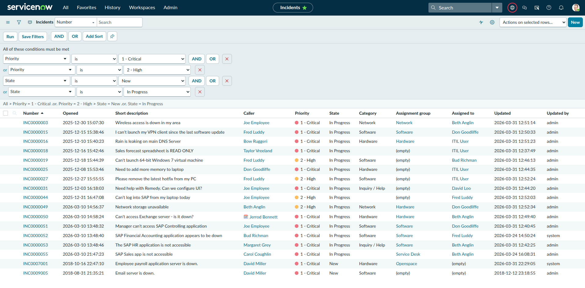
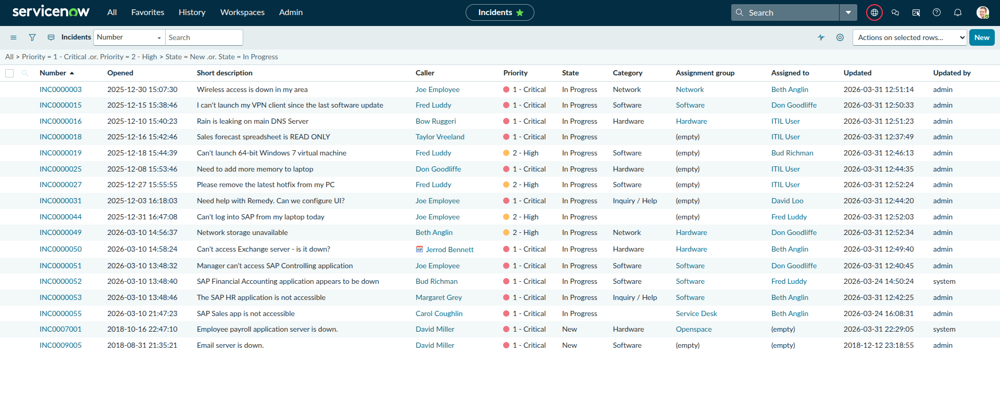
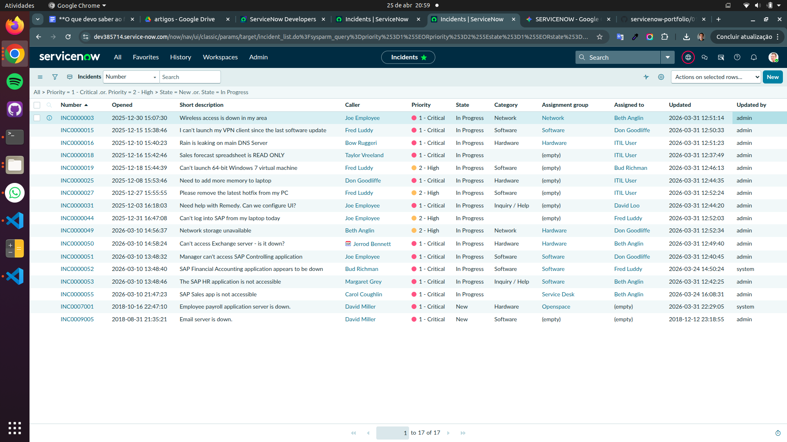
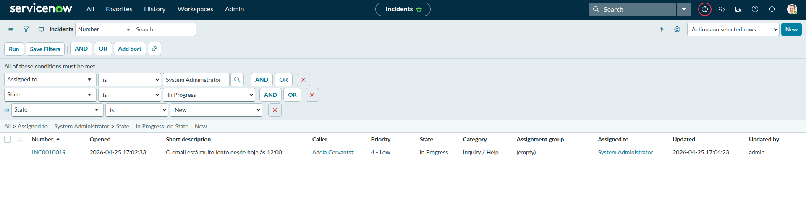
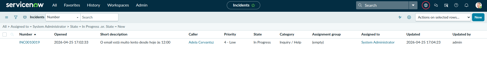
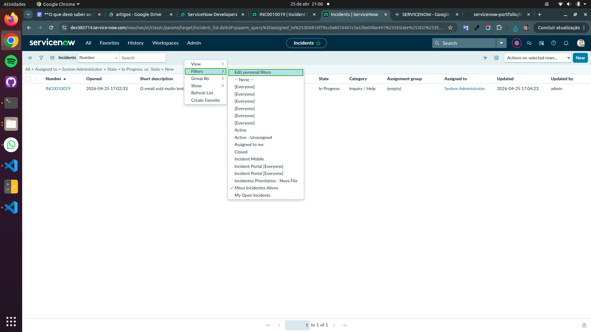

# Entregável — Filtros Salvos

**Semana:** 1 — Fundamentos
**Instância:** PDI ServiceNow (versão Australia)
**Data:** Abril 2026

---

## Objetivo

Criar e salvar 2 filtros na lista de incidentes para simular as filas de
trabalho de um ambiente corporativo real, permitindo acesso rápido aos
registros mais relevantes sem filtrar manualmente a cada acesso.

---

## Filtro 1 — Incidentes Prioritários - Nova Fila

**Propósito:** exibir todos os incidentes com prioridade Critical ou High
que ainda não foram atendidos ou estão em atendimento. Simula a fila de
triagem de um gestor ou coordenador de suporte.

**Condições aplicadas:**

```
(Priority = 1 - Critical  OR  Priority = 2 - High)
AND
(State = New  OR  State = In Progress)
```

**Observação técnica:** o ServiceNow interpreta condições com OR dentro
de grupos de AND. As duas condições de Priority formam um grupo ligado por
OR, e as duas condições de State formam outro grupo ligado por OR. Os dois
grupos são ligados por AND — resultando apenas em incidentes prioritários
que ainda estão ativos.







---

## Filtro 2 — Meus Incidentes Ativos

**Propósito:** exibir apenas os incidentes atribuídos ao usuário logado
que ainda estão em andamento. Simula a fila de trabalho pessoal de um
analista de suporte.

**Condições aplicadas:**

```
Assigned to = (usuário logado)
AND
(State = In Progress  OR  State = New)
```

**Observação técnica:** este filtro só funciona corretamente quando a
lista está aberta na **Default view**. Em outras views, o campo
`Assigned to` pode não estar disponível para filtragem, resultando em
lista vazia. Problema identificado durante a prática e resolvido trocando
para a Default view antes de montar o filtro.







---

## Aprendizados

- Filtros com lógica `OR` dentro de grupos `AND` precisam ser montados
  com atenção à ordem das condições — o ServiceNow avalia grupo a grupo
- A **Default view** é necessária para que todos os campos de filtragem
  estejam disponíveis, incluindo `Assigned to`
- Filtros salvos aparecem na barra lateral da lista e podem ser aplicados
  com um clique — reduzindo o tempo de navegação no dia a dia operacional
- Em produção, filtros podem ser compartilhados com grupos inteiros,
  padronizando a fila de trabalho de toda a equipe
