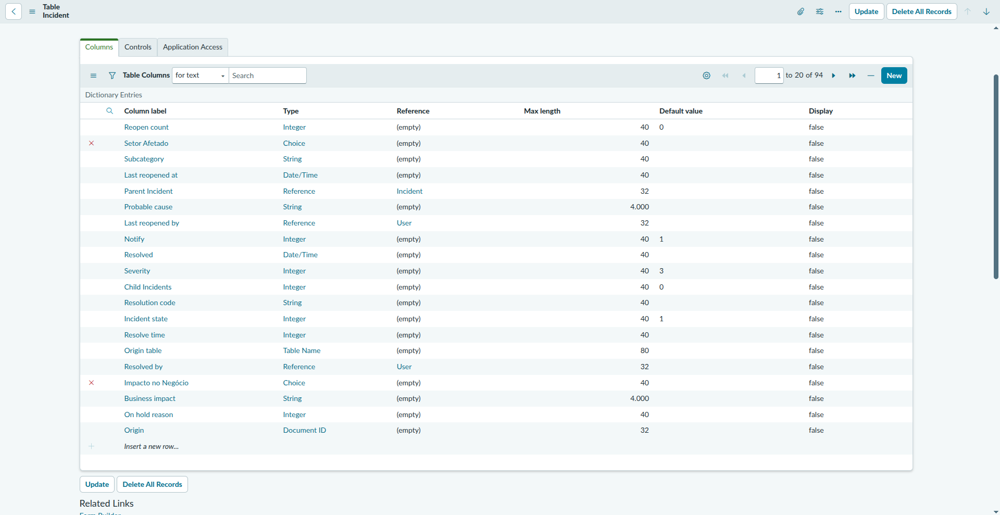
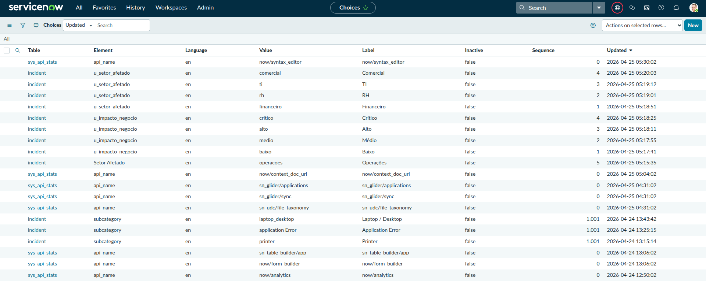
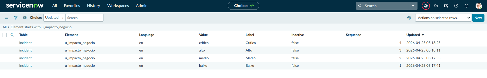
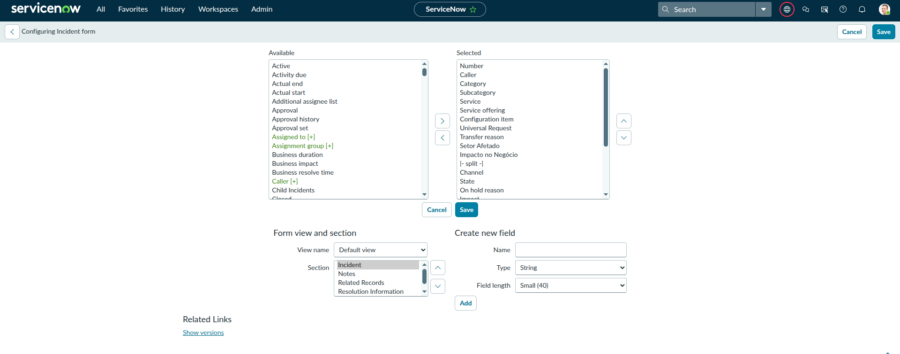
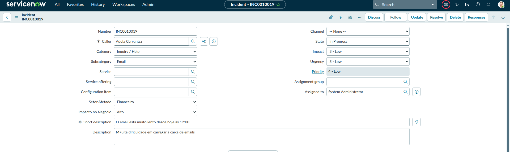

# Entregável — Personalização do Formulário de Incidente

**Semana:** 1 — Fundamentos
**Instância:** PDI ServiceNow (versão Australia)
**Data:** Abril 2026

---

## Objetivo

Criar 2 campos customizados na tabela `incident` e reorganizar o formulário
para que esses campos apareçam em uma posição lógica, logo abaixo de
Short Description e Priority.

---

## Campos criados

Os campos foram criados diretamente na tabela `incident` via
**System Definition → Tables → incident → aba Columns**.

### Campo 1 — Setor Afetado

| Propriedade | Valor |
|---|---|
| Column label | Setor Afetado |
| Column name | `u_setor_afetado` |
| Type | Choice |
| Tabela | incident |

**Choices configuradas via `sys_choice.list`:**

| Label | Value | Sequence |
|---|---|---|
| Financeiro | financeiro | 1 |
| RH | rh | 2 |
| TI | ti | 3 |
| Comercial | comercial | 4 |
| Operações | operacoes | 5 |

### Campo 2 — Impacto no Negócio

| Propriedade | Valor |
|---|---|
| Column label | Impacto no Negócio |
| Column name | `u_impacto_negocio` |
| Type | Choice |
| Tabela | incident |

**Choices configuradas via `sys_choice.list`:**

| Label | Value | Sequence |
|---|---|---|
| Baixo | baixo | 1 |
| Médio | medio | 2 |
| Alto | alto | 3 |
| Crítico | critico | 4 |

---

## Prints — criação dos campos na tabela

---

## Prints — Choice Lists configuradas

---

## Reorganização do formulário (Form Layout)

Com os campos criados na tabela, eles foram adicionados ao formulário via
**botão direito no cabeçalho do formulário → Configure → Form Layout**.

Os dois campos foram posicionados logo abaixo de Short Description e Priority,
em uma ordem que faz sentido para o fluxo de preenchimento do atendente.

---

## Formulário com os campos funcionando

Print de um incidente aberto mostrando os dois campos com valores
selecionados, confirmando que o formulário, as choices e o layout
estão funcionando corretamente.

---

## Aprendizados

- O campo **Element** no `sys_choice.list` deve conter o **nome técnico
  da coluna** (`u_setor_afetado`), não o label de exibição ("Setor Afetado").
  Usar o label resulta em dropdown vazio no formulário — erro identificado
  e corrigido durante a prática via **botão direito no campo → Show field name**
- Alterações no Form Layout afetam todos os usuários daquela tabela —
  em produção, sempre alinhar com o time antes de modificar
- Campos com prefixo `u_` são campos customizados — convenção do
  ServiceNow para diferenciar campos nativos de campos criados pelo cliente
- Campos customizados são automaticamente capturados no Update Set ativo
  no momento da criação
