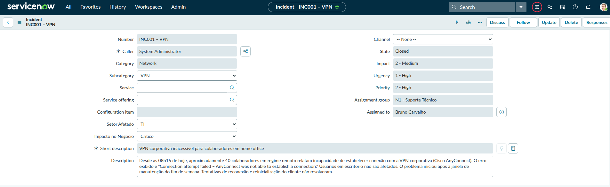
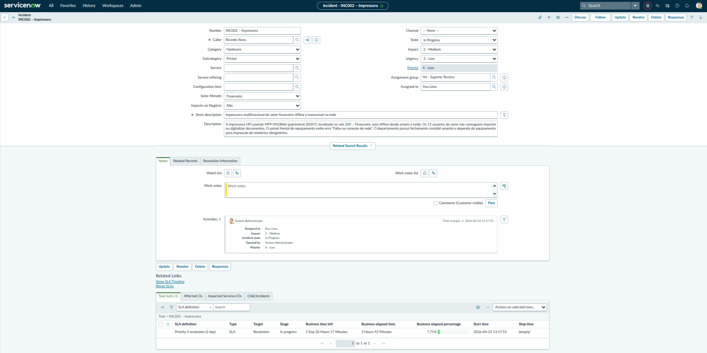
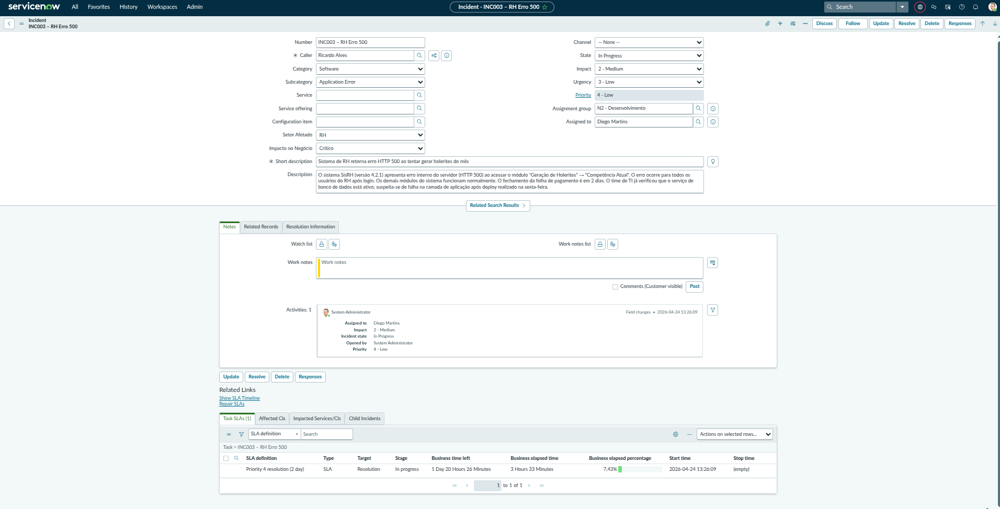
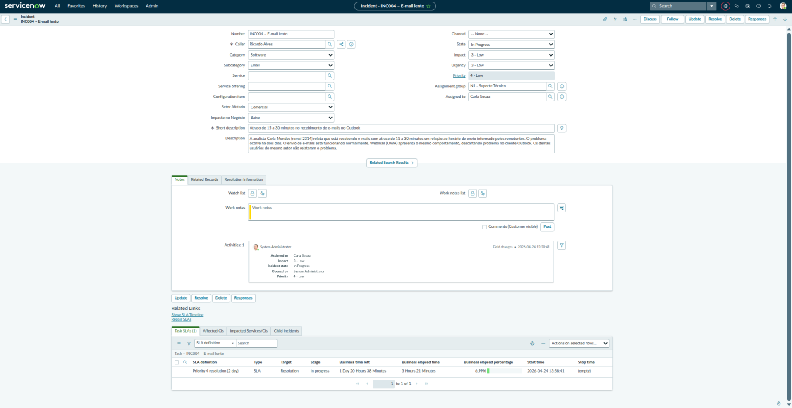
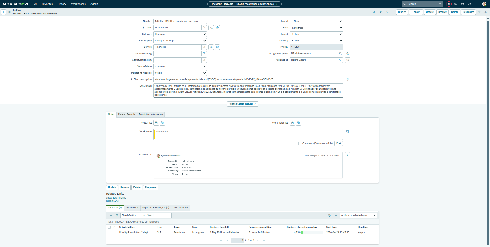
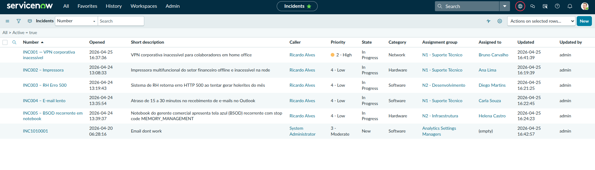

# Entregável — 5 Incidentes Criados

**Semana:** 1 — Fundamentos
**Instância:** PDI ServiceNow (versão Australia)
**Data:** Abril 2026

---

## Objetivo

Criar 5 incidentes simulando um ambiente corporativo real, com todos os
campos de triagem preenchidos: categoria, subcategoria, impacto, urgência,
grupo de atribuição e usuário responsável. Os incidentes cobrem diferentes
categorias, prioridades e setores para refletir a variedade de um ambiente
ITSM em operação.

---

## Estrutura criada antes dos incidentes

Para tornar a simulação mais realista, foram criados previamente:

**Grupos:**

- N1 - Suporte Técnico
- N2 - Infraestrutura
- N2 - Desenvolvimento

**Usuários técnicos (papel `itil`):**

- Ana Lima, Bruno Carvalho, Carla Souza — N1 - Suporte Técnico
- Diego Martins, Fernanda Rocha — N2 - Infraestrutura
- Gabriel Nunes, Helena Castro — N2 - Desenvolvimento

**Campos customizados criados na tabela `incident`:**

- `u_setor_afetado` (Choice): Financeiro, RH, TI, Comercial, Operações
- `u_impacto_negocio` (Choice): Baixo, Médio, Alto, Crítico

---

## INC001 — VPN corporativa inacessível

**Prioridade:** 1 - Critical
**Categoria:** Network / VPN Remote Access
**Grupo:** N1 - Suporte Técnico
**Atribuído a:** Bruno Carvalho
**Setor Afetado:** TI
**Impacto no Negócio:** Crítico

---

## INC002 — Impressora do financeiro offline

**Prioridade:** 2 - High
**Categoria:** Hardware / Printer
**Grupo:** N1 - Suporte Técnico
**Atribuído a:** Ana Lima
**Setor Afetado:** Financeiro
**Impacto no Negócio:** Alto

---

## INC003 — Sistema de RH retorna erro 500

**Prioridade:** 1 - Critical
**Categoria:** Software / Application Error
**Grupo:** N2 - Desenvolvimento
**Atribuído a:** Gabriel Nunes
**Setor Afetado:** RH
**Impacto no Negócio:** Crítico

---

## INC004 — Lentidão no recebimento de e-mails

**Prioridade:** 3 - Moderate
**Categoria:** Email / Performance
**Grupo:** N1 - Suporte Técnico
**Atribuído a:** Carla Souza
**Setor Afetado:** Comercial
**Impacto no Negócio:** Baixo

---

## INC005 — BSOD recorrente no notebook do gerente

**Prioridade:** 1 - Critical
**Categoria:** Hardware / Laptop
**Grupo:** N2 - Infraestrutura
**Atribuído a:** Diego Martins
**Setor Afetado:** Comercial
**Impacto no Negócio:** Médio

---

## Lista geral de incidentes

Print da lista completa mostrando os 5 incidentes com prioridade, estado
e atribuição visíveis na Default view.

---

## Aprendizados

- Campos `u_setor_afetado` e `u_impacto_negocio` customizados aparecem
  em todos os incidentes após configuração do Form Layout
- Roteamento correto por grupo: incidentes de software e aplicação vão
  para N2 - Desenvolvimento, não para N1 — prática ITIL de triagem
- Prioridade é calculada pela combinação de Impacto + Urgência, não é
  um campo de preenchimento livre
- INC005 tem urgência Alta com impacto de apenas 1 usuário — o contexto
  de negócio (apresentação externa em 48h) justifica a prioridade crítica,
  demonstrando que impacto no negócio vai além do número de usuários afetados
