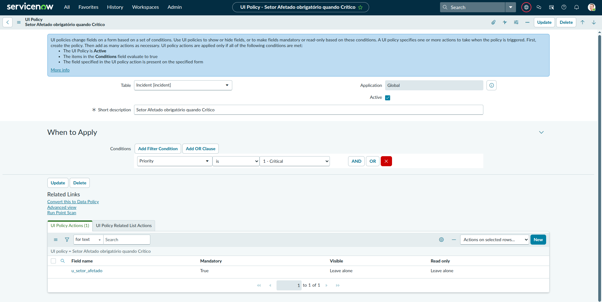
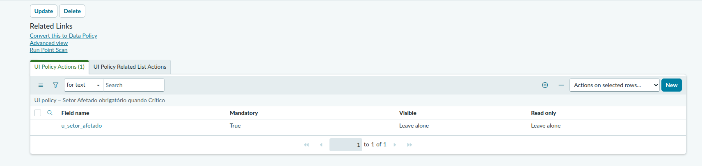
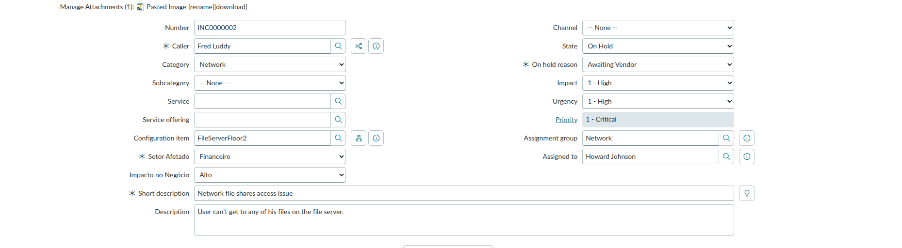
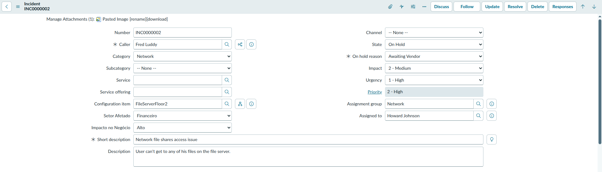

# Entregável — UI Policy

**Semana:** 1 — Fundamentos
**Instância:** PDI ServiceNow (versão Australia)
**Data:** Abril 2026

---

## Objetivo

Configurar uma UI Policy que torne o campo `u_setor_afetado` obrigatório
quando a prioridade do incidente for Critical — demonstrando controle
dinâmico de comportamento do formulário sem necessidade de código JavaScript.

---

## Configuração da UI Policy

Navegue em: **System UI → UI Policies → New**

### Aba principal

| Campo | Valor |
|---|---|
| Table | Incident [incident] |
| Name | Setor Afetado obrigatório quando Crítico |
| Active | true |
| On load | true |
| Reverse if false | true |

**Por que "Reverse if false" é importante:** sem essa opção, o campo
continuaria obrigatório mesmo quando a prioridade fosse alterada para
outro valor. Com ela, o ServiceNow desfaz automaticamente a ação quando
a condição deixa de ser verdadeira — eliminando a necessidade de criar
uma segunda UI Policy para o comportamento inverso.

**Por que "On load" é importante:** garante que a regra seja avaliada
também quando o formulário é carregado, não apenas quando campos são
alterados. Sem isso, um incidente já criado com prioridade Critical
abriria sem o campo obrigatório.

### Condição (quando a regra dispara)

| Campo | Operador | Valor |
|---|---|---|
| Priority | is | 1 - Critical |

### UI Policy Action (o que acontece)

| Campo | Valor |
|---|---|
| Field name | Setor Afetado (`u_setor_afetado`) |
| Mandatory | true |
| Visible | leave alone |
| Read only | leave alone |

---

## Prints — configuração

---

## Prints — funcionamento

Formulário com **Priority = 1 - Critical**: campo Setor Afetado exibe
asterisco vermelho indicando obrigatoriedade.

Formulário com **Priority = 2 - High**: campo Setor Afetado sem asterisco,
confirmando que o Reverse if false funcionou corretamente.

---

## Aprendizados

- **UI Policy vs Business Rule:** UI Policies controlam o comportamento
  visual do formulário no lado do cliente (obrigatoriedade, visibilidade,
  somente leitura). Business Rules executam lógica no servidor. Para
  validações visuais simples, UI Policy é a ferramenta correta
- **Reverse if false:** elimina a necessidade de criar uma segunda policy
  para desfazer a regra — sempre ativar quando a ação deve ser reversível
- **On load:** necessário para que a policy seja avaliada ao abrir
  o formulário, não apenas ao alterar campos
- UI Policies são capturadas automaticamente no Update Set ativo
- Em entrevistas, esse é um exemplo recorrente de pergunta prática:
  "como você tornaria um campo obrigatório apenas em determinada condição
  sem escrever código?" — a resposta é UI Policy com Reverse if false
