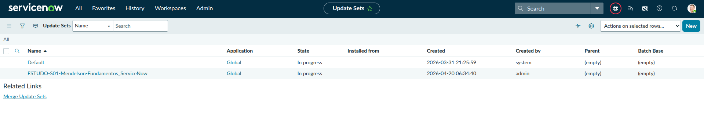
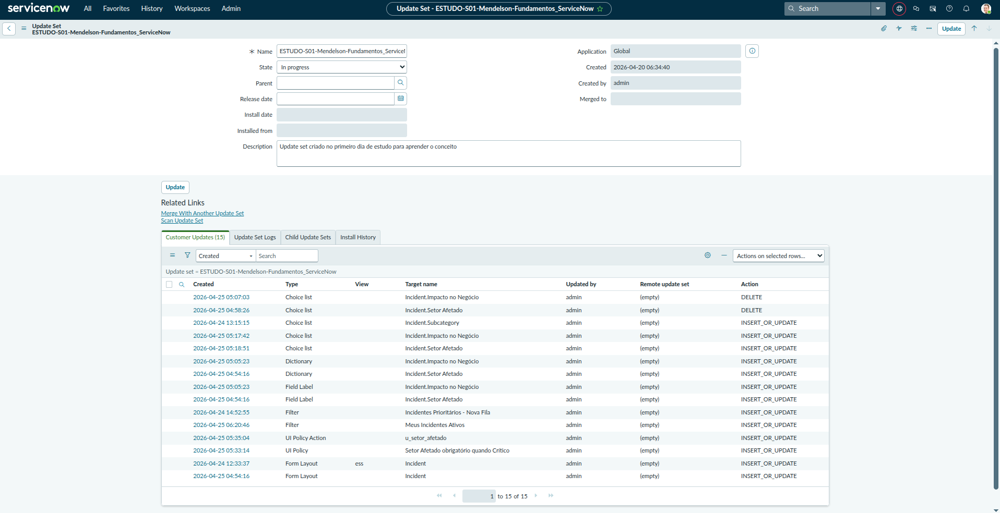
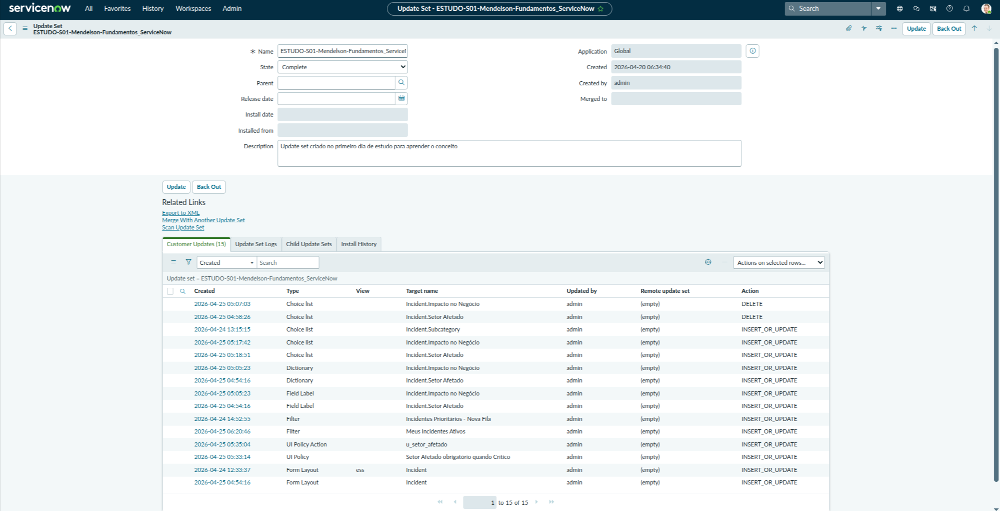
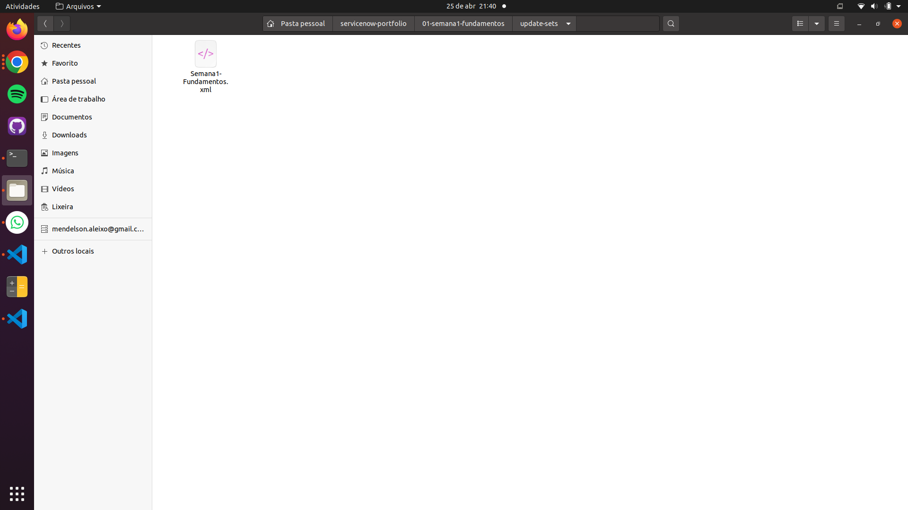

# Entregável — Update Set

**Semana:** 1 — Fundamentos
**Instância:** PDI ServiceNow (versão Australia)
**Data:** Abril 2026
**Arquivo exportado:** `update-sets/Semana1-Fundamentos.xml`

---

## Objetivo

Criar um Update Set ativo antes do início das customizações da semana,
garantindo que todas as alterações sejam capturadas automaticamente,
e exportá-lo como XML ao final — demonstrando o fluxo básico de
controle de mudanças no ServiceNow.

---

## Por que o Update Set foi criado antes das customizações

O Update Set só captura as mudanças feitas **enquanto está ativo como
"Current"**. Por isso, o primeiro passo antes de qualquer customização
foi criar e ativar o Update Set — não o último.

Tudo que foi feito na semana enquanto o Update Set estava ativo foi
capturado automaticamente:

- Criação dos campos `u_setor_afetado` e `u_impacto_negocio`
- Configuração das Choice Lists via `sys_choice.list`
- Alterações no Form Layout do formulário de incidente
- Criação da UI Policy de obrigatoriedade

---

## Configuração do Update Set

Navegue em: **filtro de navegação → `sys_update_set.list` → New**

| Campo       | Valor                                                                                                                                              |
| ----------- | -------------------------------------------------------------------------------------------------------------------------------------------------- |
| Name        | Semana1-Fundamentos-MendelsonAleixo                                                                                                                |
| Description | Campos customizados (u_setor_afetado, u_impacto_negocio), Choice Lists, Form Layout e UI Policy criados durante a Semana 1 do portfólio ServiceNow |
| State       | In Progress                                                                                                                                        |

Após criar, clique em **Set as Current Update Set** (em Related Links)
para ativá-lo.

---

## Print — Update Set ativo (In Progress)

---

## Customizações capturadas

Print da Related List **Customer Updates** mostrando os registros
capturados automaticamente durante a semana.

---

## Conclusão do Update Set

Após o término de todas as customizações, o estado foi alterado para
**Complete** — sinalizando que está pronto para ser transportado.

---

## Exportação como XML

Clique em **Export to XML** para gerar o arquivo transportável. O arquivo
foi salvo em `update-sets/Semana1-Fundamentos.xml` no repositório.

---

## Aprendizados

- O Update Set deve ser criado e ativado **antes** de começar qualquer
  customização — não ao final. Mudanças feitas sem Update Set ativo vão
  para o Update Set padrão do sistema ("Default Update Set")
- **O que foi capturado:** campos, choices, form layout e UI Policy —
  tudo transportável via XML para outra instância
- **O que não foi colocado:** registros de incidentes, usuários e grupos
  criados na semana não entram no Update Set — são dados, não configuração
- O arquivo XML exportado é a evidência técnica de tudo que foi configurado,
  podendo ser importado e aplicado em qualquer outra instância ServiceNow
- Em ambientes reais, esse XML seria importado na instância de QA, testado,
  e depois promovido para Produção — esse é o fluxo de release management
  do ServiceNow
