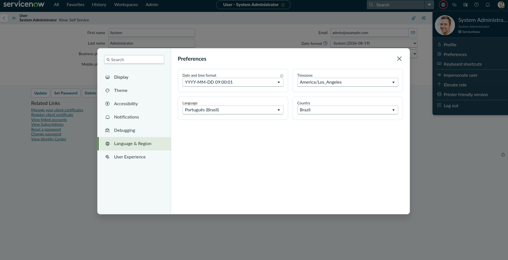

# LAB 02 — Desenvolvimento & Dados

## O que era esperado

Construir o modelo relacional de dados da loja estruturando tabelas customizadas, realizando a importação de uma massa de dados via planilha Excel (`AuMiau-Produtos-Importacao.xlsx`), estendendo a tabela nativa `Task` para criar tabelas transacionais de processo e organizando a navegação em um Application Menu dividido em quatro blocos.

---

## Como foi feito

1. **Tabela Categoria:** Criação da tabela customizada `x_aumiau_categoria` do zero no Studio, configurando auto-numeração com prefixo `CAT` (início em 100, 5 dígitos), regras de CRUD por ACLs (`admin` com acesso total e `user` com Create, Read, Write) e preenchimento inicial com as 5 categorias do catálogo pet (Ração, Higiene, Brinquedos, Acessórios e Farmácia Pet).
2. **Tabela Produto:** Importação da planilha Excel de produtos para gerar a tabela `x_aumiau_produto` (prefixo `PRD`), configurando permissões completas de CRUD para administrador e usuário, além de criar o campo de referência para a tabela de Categorias (`x_aumiau_categoria`).
3. **Tabelas de Processo (Ouvidoria e Pedidos):** Criação da tabela de Ouvidoria (`x_aumiau_ouvidoria`, prefixo `OUV`) e da tabela de Pedidos (`x_aumiau_pedido`, prefixo `PED`, iniciando em 1000) estendidas a partir da tabela nativa `Task`, herdando número, estados, atribuição e controle de SLA. Na tabela de Pedidos, foram estruturados os campos de produto (referência), data de entrega, nome do cliente e desconto.
4. **Application Menu:** Configuração do menu de navegação unificado *AuMiau Pet Shop* contendo módulos de lista e novo registro para cada tabela, separados em blocos lógicos por meio de elementos do tipo *Separator*.

---

## Comprovação Prática

> _A imagem abaixo comprova o sucesso da execução desta etapa:_

