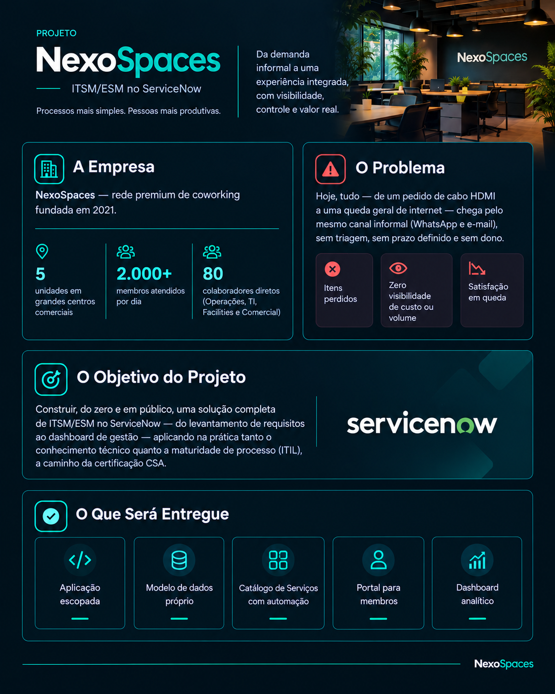

# NexoSpaces

Projeto autoral de portfólio, simulando o desenho e a construção de uma solução de **ITSM/ESM** para uma rede fictícia de coworking premium na Now Platform.

Diferente de um projeto guiado direto pelo build, este começa pela camada que normalmente fica invisível para quem só mostra o resultado final: descoberta de negócio, levantamento de requisitos e mapeamento de processo em ITIL, antes de qualquer tabela ser criada no Studio.

---

## Visão Geral do Projeto

A **NexoSpaces** (fundada em 2021, 5 unidades em grandes centros comerciais, com 2.000+ membros atendidos diariamente entre freelancers, startups e filiais corporativas) escalou rápido — o crescimento veio da abertura de novas unidades, sem investimento equivalente em operação centralizada — e deixou os processos internos para trás: hoje, do empréstimo de um cabo HDMI a uma queda geral de internet, tudo chega pelo mesmo canal informal — WhatsApp e e-mail — sem triagem, prazo ou rastreabilidade. O desafio consiste em substituir esse fluxo manual por uma **aplicação de ITSM/ESM escopada no ServiceNow**, cobrindo reserva de espaços, pedidos de equipamento, gestão de incidentes de TI/Facilities e um dashboard gerencial de ocupação e SLA.

---

## Arquitetura e Módulos Previstos

A solução está sendo desenvolvida sobre os principais pilares do ecossistema ServiceNow:

- **App Engine / Studio:** aplicação escopada dedicada, com perfis de acesso distintos para membro, Community Manager, técnico de TI, Facilities e diretoria.
- **Data Model & Data Management:** tabelas de Espaços, Reservas, Solicitações de Equipamento, Incidentes de TI e Chamados de Facilities.
- **Service Catalog & Automação (Flow Designer):** catálogo de serviços para reservas e pedidos, fluxo de aprovação e matriz de Prioridade x SLA para classificação automática de incidentes.
- **Service Portal:** portal de membros com identidade visual própria, acompanhamento de status da solicitação e Base de Conhecimento com sugestão automática na busca.
- **Platform Analytics:** dashboard gerencial com ocupação de espaços, volume de chamados e cumprimento de SLA.

---

## Status e Documentação

- ✅ **Etapa 0 — Descoberta & Requisitos:** contexto de negócio, personas e levantamento de requisitos ([`etapa00.md`](./etapa00.md))
- ✅ **Etapa 1 — Arquitetura & Processo:** mapeamento das práticas ITIL e requisitos derivados ([`etapa01.md`](./etapa01.md))
- 🔄 **Etapa 2 em diante** — fundação técnica, modelo de dados, catálogo/automação, portal e dashboard, documentadas aqui conforme avançam, seguindo o mesmo padrão de Conventional Commits adotado no restante do portfólio.

O processo de construção é documentado publicamente também no LinkedIn, em formato _build in public_ — cada etapa vira um post explicando não só o que foi entregue, mas por que as decisões técnicas foram tomadas daquele jeito.

---

## Sobre Mim

ServiceNow Developer em transição de carreira, unindo 17 anos de experiência em ambientes de alta responsabilidade (medicina veterinária e cirurgia) com desenvolvimento técnico na plataforma ServiceNow — triagem e priorização de casos por urgência e gravidade é o mesmo raciocínio por trás de uma matriz de prioridade de incidentes.

Acesse o meu [LinkedIn](https://www.linkedin.com/in/mendelson-aleixo/) para acompanhar minha trajetória profissional e o andamento deste projeto.
