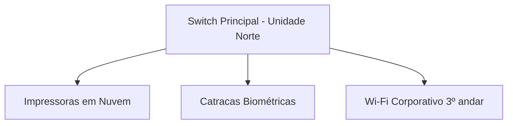

# NexoSpaces — Etapa 1: Mapeamento ITIL & Arquitetura

> Continuação da Etapa 0 (contexto de negócio e requisitos RF01–RF07). Este documento traduz o dia a dia da NexoSpaces para as práticas formais de ITIL/ITSM, identifica os requisitos que ainda faltavam e define o que efetivamente vira build técnico dentro do prazo do projeto.

## As 7 Práticas ITIL no Dia a Dia da NexoSpaces

### 1. Gestão de Incidentes (Incident Management)

**Cenário:** segunda-feira, 08h30 — a catraca biométrica da Unidade Centro para de ler digitais e uma fila se forma na recepção; simultaneamente, o Wi-Fi do 3º andar cai.
**Visão ITIL:** interrupção não planejada de um serviço de TI/Facilities.
**Solução ServiceNow:** o Community Manager abre um Incidente. Entra a **Matriz de Prioridade (Impacto x Urgência)** — a catraca afetando dezenas de pessoas é P1 (Crítico); um ar-condicionado pingando numa sala vazia é P4 (Baixo).
→ _Requisitos derivados:_ RF08 (matriz de prioridade), RF03 (já existente, ganha critério formal de classificação)

### 2. Cumprimento de Requisição (Request Fulfillment / Service Catalog)

**Cenário:** uma startup contratou 3 desenvolvedores e precisa de 3 cadeiras ergonômicas e 3 monitores extras.
**Visão ITIL:** nada quebrou — é um pedido padrão de item/serviço.
**Solução ServiceNow:** a startup abre um Catalog Item no portal. Um Flow Designer dispara aprovação do financeiro (custo extra) e cria duas Catalog Tasks (SCTASK) — uma para TI preparar os monitores, outra para Facilities separar as cadeiras.
→ _Já coberto por RF02 e RF05 (Etapa 0) — sem requisito novo, só reforça o desenho já feito._

### 3. Gestão de Problemas (Problem Management)

**Cenário:** o roteador da Unidade Sul trava toda terça às 15h. A TI reinicia (resolve o incidente na hora), mas o problema volta toda semana.
**Visão ITIL:** Incidente é apagar o incêndio; Problema é achar a causa raiz pra ele não voltar a acontecer.
**Solução ServiceNow:** um registro de Problem é aberto, associado aos incidentes recorrentes. A causa (bug de firmware) é investigada, um workaround é documentado enquanto a correção definitiva é planejada.
→ _Requisito derivado:_ RF09

### 4. Gestão de Mudanças (Change Enablement)

**Cenário:** para resolver o bug do roteador de vez, a TI precisa atualizar o firmware nas 5 unidades — sem poder simplesmente desligar a rede em horário comercial.
**Visão ITIL:** mudanças em produção exigem controle e aprovação.
**Solução ServiceNow:** a TI abre uma Change Request. Um fluxo de aprovação (CAB) é acionado, a mudança é agendada pra sábado de madrugada, com plano de rollback documentado.
→ _Requisito derivado:_ RF10

### 5. Base de Conhecimento (Knowledge Management)

**Cenário:** o suporte de TI gasta 40% do tempo respondendo à mesma pergunta no WhatsApp — "como configuro a impressora no Mac?".
**Visão ITIL:** conhecimento tácito precisa virar autoatendimento (Tier 0).
**Solução ServiceNow:** uma Knowledge Base é criada. Ao buscar "impressora" no portal, o sistema sugere o artigo antes de permitir abrir chamado (**Incident Deflection**) — o chamado às vezes nem chega a ser criado.
→ _Requisito derivado:_ RF11

### 6. Gestão de Nível de Serviço (SLA, OLA e UC)

**Cenário:** um executivo de uma empresa parceira reserva a sala principal e o projetor queima 5 minutos antes da apresentação.
**Visão ITIL:** existem promessas de tempo em camadas diferentes, internas e externas.
**Solução ServiceNow:** o **SLA** prometido ao cliente é 2h para o conserto. Por trás, uma **OLA** interna dá 15 min pra recepção repassar o chamado à TI. E existe um **UC** — o contrato da NexoSpaces com a Epson exige substituição em 24h.
→ _Requisitos derivados:_ RF08 (matriz/SLA), RF13 (UC com fornecedores)

### 7. CMDB e Gestão de Ativos (Configuration Management)

**Cenário:** um raio cai na Unidade Norte e queima o Switch Principal.
**Visão ITIL:** é preciso saber o que quebrou, onde está, quanto custou e quem é afetado.
**Solução ServiceNow:** o técnico vincula o Incidente a um Configuration Item (CI) no CMDB. Pelo mapa de dependências, a TI já sabe que o Switch (CI A) derruba Impressoras em Nuvem (CI B) e Catracas (CI C) — e já tem garantia e número de série antes de sair do lugar.
→ _Requisito derivado:_ RF12

_Mapa de dependência simples entre Configuration Items — é este tipo de relação que o CMDB torna visível._

---

## Requisitos Adicionais Identificados (continuação de RF01–RF07)

| ID   | Requisito                                                                                                           | Prática ITIL               | Onde é construído  |
| ---- | ------------------------------------------------------------------------------------------------------------------- | -------------------------- | ------------------ |
| RF08 | Matriz de Prioridade (Impacto x Urgência) classificando incidentes automaticamente em P1–P4, com SLA por prioridade | Incident Management / SLA  | Etapa 4            |
| RF09 | Registro de Problema vinculado a incidentes recorrentes, com causa raiz e workaround documentados                   | Problem Management         | Etapa 4 (extensão) |
| RF10 | Change Request com aprovação (CAB simplificado) e plano de rollback documentado                                     | Change Enablement          | Etapa 4 (extensão) |
| RF11 | Base de Conhecimento com artigos e sugestão automática na busca do portal antes de abrir chamado                    | Knowledge Management       | Etapa 5            |
| RF12 | Registro de Configuration Items (CI) para ativos críticos, com relação de dependência entre eles                    | CMDB / Asset Management    | Etapa 3 (extensão) |
| RF13 | Cadastro de contratos com fornecedores externos vinculados a SLA de reposição (ex: Epson, 24h)                      | UC — Underpinning Contract | Etapa 3 (extensão) |

## Matriz de Prioridade e SLA (a peça que faltava para RF08 ser construível)

|                   | Urgência Alta                                | Urgência Média                            | Urgência Baixa                           |
| ----------------- | -------------------------------------------- | ----------------------------------------- | ---------------------------------------- |
| **Impacto Alto**  | P1 – Crítico (resposta 15min / resolução 2h) | P2 – Alto (resposta 30min / resolução 4h) | P3 – Médio (resposta 2h / resolução 8h)  |
| **Impacto Médio** | P2 – Alto (resposta 30min / resolução 4h)    | P3 – Médio (resposta 2h / resolução 8h)   | P4 – Baixo (resposta 4h / resolução 24h) |
| **Impacto Baixo** | P3 – Médio (resposta 2h / resolução 8h)      | P4 – Baixo (resposta 4h / resolução 24h)  | P4 – Baixo (resposta 4h / resolução 24h) |

- **OLA (interno):** recepção repassa à TI em até 15 min.
- **UC (externo, exemplo):** fornecedor Epson substitui projetor em até 24h.

---

## O Que Vira Build Real vs. O Que Fica Documentado

Sete práticas ITIL num projeto júnior de 2 meses (que ainda precisa dividir espaço com o estudo da CSA) é ambicioso demais se tudo virar build completo. Esta tabela existe pra proteger o cronograma sem perder a maturidade da narrativa:

| Prática                        | Nível recomendado                                                      | Por quê                                                                                              |
| ------------------------------ | ---------------------------------------------------------------------- | ---------------------------------------------------------------------------------------------------- |
| Incident Management            | **Build completo**                                                     | Núcleo do projeto e da CSA — sem isso não há Etapa 4                                                 |
| Request Fulfillment / Catálogo | **Build completo**                                                     | Já estava no escopo original (RF02, RF05)                                                            |
| SLA (matriz P1–P4)             | **Build** (SLA Definitions simples)                                    | Nível CSA, alto retorno de credibilidade pelo esforço                                                |
| Knowledge Management           | **Build simplificado** (2–3 artigos + busca)                           | Baixo esforço, extensão natural da Etapa 5                                                           |
| Problem Management             | **Build simplificado** (tabela vinculada a Incidentes)                 | Baixo esforço técnico, mostra distinção conceitual muito valorizada em entrevista                    |
| CMDB / CI                      | **Documentar + cadastro manual** de 3–4 CIs (sem Discovery automático) | Discovery automático foge do escopo júnior; cadastro manual já ilustra o conceito                    |
| Change Enablement (CAB)        | **Documentar + versão simplificada** (1 aprovação, sem CAB completo)   | CAB completo é território mais sênior; a versão simplificada já comunica que você entende o processo |
| OLA / UC                       | **Documentar na narrativa**, sem virar registro técnico separado       | Baixo retorno técnico pelo esforço, alto retorno narrativo                                           |

## Onde isso entra no cronograma

- **Dentro da Etapa 4 (Outubro):** matriz de prioridade/SLA + Problem Management simplificado — ambos de baixo esforço técnico e encaixam no mesmo bloco de catálogo/automação.
- **Dentro da Etapa 5 (Outubro/Novembro):** Base de Conhecimento com deflection no portal.
- **Pós-certificação (dezembro):** cadastro manual de CMDB (estudo 03/12, post 04/12) + Change Request simplificada (estudo 04/12, post 07/12) — ótima pauta de post logo depois da prova, sem ter competido pelo tempo de estudo da CSA. Datas exatas no Calendário de Posts.

## Conexão com Estudo, Aplicação e Cronograma

> Seção lida pela skill `/hoje` — é o que conecta este documento ao dia a dia real de estudo/construção/post.

- **Bloco CSA:** não aplicável diretamente — mesma natureza da Etapa 0 (trabalho de mapeamento de processo, não configuração). Toca conceitos gerais dos Blocos 3 e 4, mas sem módulo específico do curso técnico.
- **Fonte teórica:** este próprio documento — mapeamento ITIL autoral, não vem do curso.
- **Aplicar na PDI:** nada ainda nesta etapa — é mapeamento de processo e arquitetura, antes de configurar qualquer coisa.
- **Documentar:** este arquivo já é o registro da etapa, versionado no GitHub.
- **Post:** publicados em 25/09 (Incident Management + matriz), 28/09 (Problem vs. Incidente) e 30/09 (SLA/OLA/UC + diagrama CMDB) — ver Calendário de Posts.

---

**Próximo passo:** com RF01–RF13 e a matriz de SLA fechados, a Etapa 2 (fundação técnica) já pode começar com o modelo de dados sabendo exatamente quais tabelas e relações vai precisar.
