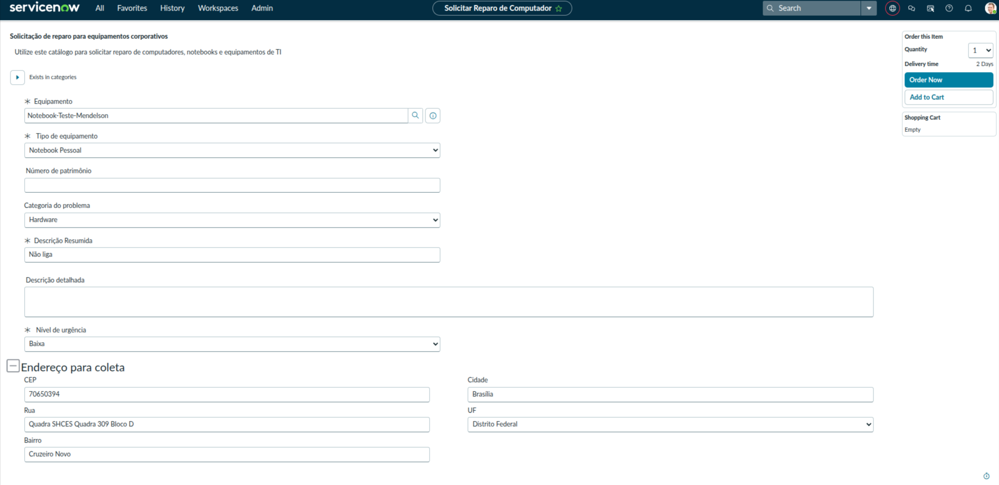
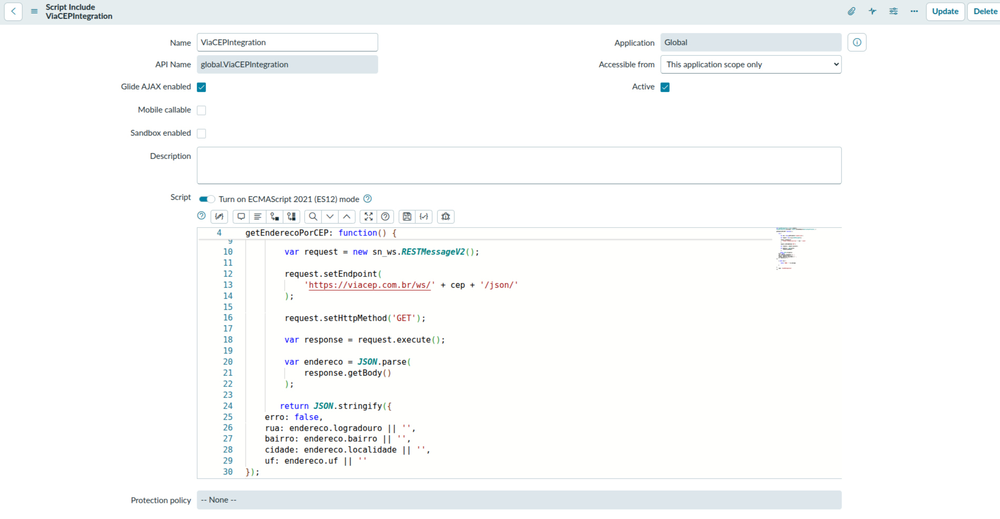
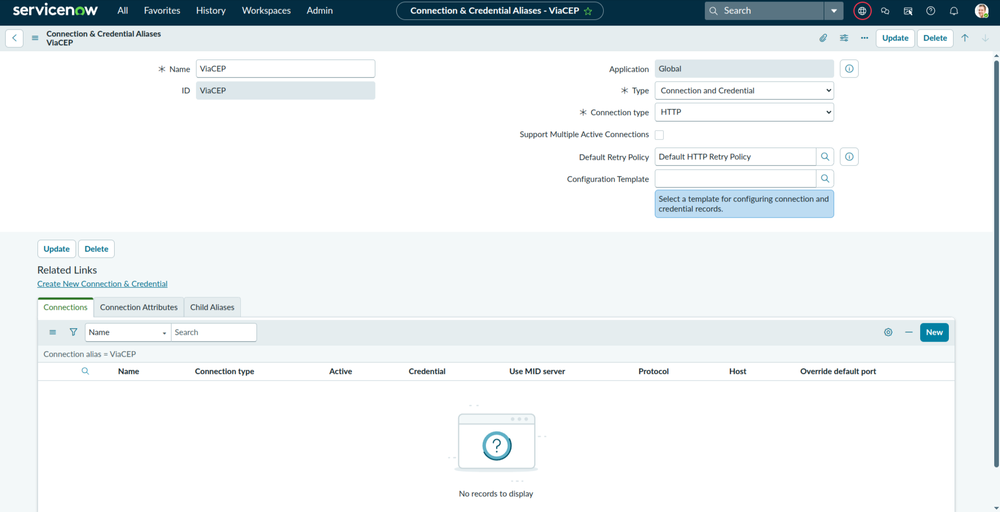
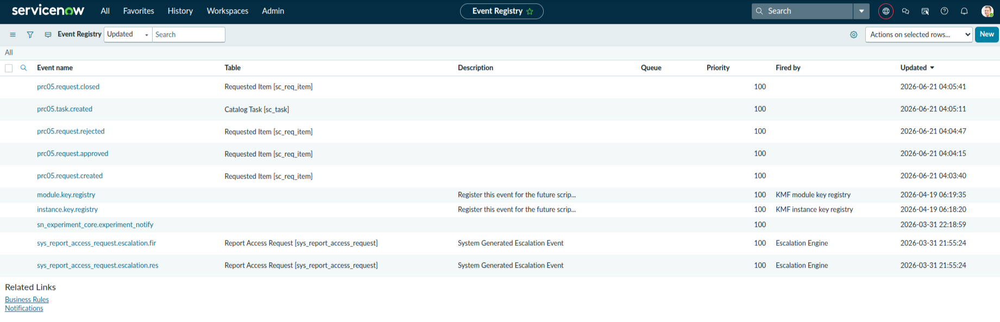

# Arquitetura — Portal de Reparo de Computadores

[← Voltar ao projeto](../README.md)

Visão técnica de como os componentes do projeto se conectam: catálogo, integração de CEP (duas abordagens), automação no Flow Designer e Notification Framework.

---

## Visão geral

```text
Service Portal (Catalog Item)
        │
        ├─ variáveis do formulário ── Reference Qualifier (RN001, filtra por owned_by)
        │
        ├─ campo CEP ── onChange ──▶ Client Script ──▶ GlideAjax ──▶ Script Include ──▶ API ViaCEP
        │                                                  (PRC-03A · abordagem tradicional)
        │
        │                        ou ──▶ IntegrationHub Action (ViaCEP) ──▶ API ViaCEP
        │                                                  (PRC-03B · abordagem low-code)
        │
        ▼
   Requested Item (RITM) criado
        │
        ▼
   Flow Designer — "Fluxo Reparo de Computador"
        │  (aprovação do gestor, criação de Task, atualização de CMDB, notificações)
        ▼
   Catalog Task [sc_task] · Configuration Item [cmdb_ci_computer]
```

O projeto foi construído em sprints incrementais (PRC-01 a PRC-05), cada um com seu próprio Update Set — ver [`update-sets/`](../update-sets/) e o roadmap no [README](../README.md#3-roadmap).

---

## Modelo de dados

| Tabela               | Papel no projeto                                                                                      |
| -------------------- | ----------------------------------------------------------------------------------------------------- |
| `sc_cat_item`        | Catalog Item "Solicitar Reparo de Computador" — formulário de abertura da solicitação                 |
| `sc_req_item` (RITM) | Registro criado ao submeter o catálogo; carrega o campo `Approval` usado pelo Flow (RN009, RN010)     |
| `sc_task`            | Task de TI criada pelo Flow após aprovação, para execução do reparo                                   |
| `cmdb_ci_computer`   | Ativo (computador) selecionado na solicitação; tem o `install_status` atualizado pelo Flow (RN003-05) |
| `sys_user`           | Solicitante e gestor aprovador (`caller_id.manager`, RN009)                                           |

**Variáveis do Catalog Item** (evidência real, ver print abaixo): Equipamento (reference a `cmdb_ci_computer`, filtrado por RN001), Tipo de equipamento, Número de patrimônio, Categoria do problema, Descrição Resumida, Descrição detalhada (obrigatória condicionalmente — RN007), Nível de urgência, e a seção "Endereço para coleta" (CEP, Rua, Bairro, Cidade, UF — preenchida automaticamente pela RN002).



---

## Integração de CEP — duas abordagens (PRC-03A x PRC-03B)

O mesmo problema (RN002: preencher endereço a partir do CEP) foi resolvido de duas formas, para comparar a abordagem tradicional com a low-code do IntegrationHub:

| Aspecto                | PRC-03A — GlideAjax + REST                                                                                                                   | PRC-03B — IntegrationHub                                                                                            |
| ---------------------- | -------------------------------------------------------------------------------------------------------------------------------------------- | ------------------------------------------------------------------------------------------------------------------- |
| Componentes            | Client Script (`onChange`) + Script Include (`ViaCEPIntegration`) + `RESTMessageV2`                                                          | Connection & Credential Alias (`ViaCEP`) + IntegrationHub Action (Flow Designer)                                    |
| Onde a lógica mora     | Código JavaScript (server-side, chamado via GlideAjax)                                                                                       | Visual, dentro de uma Action reutilizável no Flow Designer                                                          |
| Reutilização           | Precisa ser chamada explicitamente via GlideAjax em cada Client Script                                                                       | Reutilizável como step em qualquer Flow/Action, sem escrever script                                                 |
| Arquivos deste projeto | [`scripts/client-script-cep.js`](../scripts/client-script-cep.js), [`scripts/script-include-viacep.js`](../scripts/script-include-viacep.js) | [`update-sets/PRC-03B-integracao-cep-integrationhub.xml`](../update-sets/PRC-03B-integracao-cep-integrationhub.xml) |

O Script Include real (`ViaCEPIntegration`) chama a API pública `https://viacep.com.br/ws/{cep}/json/` via `RESTMessageV2` e devolve `rua`, `bairro`, `cidade` e `uf` em JSON:



Na abordagem IntegrationHub, o mesmo endpoint é acessado por um **Connection & Credential Alias** (`ViaCEP`, tipo HTTP), consumido por uma Action do Flow Designer — sem GlideAjax nem Script Include:



> Ambas as abordagens tratam o caso de CEP inválido — ver `docs/screenshots/13` (erro na 03A) e `docs/screenshots/20` (erro na 03B), cobertos em [`testes.md`](testes.md).

---

## Flow Designer — automação do fluxo de aprovação

O Flow "Fluxo Reparo de Computador" é disparado pela criação do RITM no Service Catalog, pede aprovação do gestor, cria a Task de TI, atualiza o ativo na CMDB e dispara notificações em cada etapa. Detalhamento completo (todos os steps, condições e ramos) em [`fluxo-processo.md`](fluxo-processo.md).

---

## Notification Framework (PRC-05)

Notificações e eventos customizados, prefixados `prc05.*`, disparados pelo Flow em pontos-chave do processo (RN008):

| Evento (`sys_event`)     | Tabela                       | Notificação disparada                                    |
| ------------------------ | ---------------------------- | -------------------------------------------------------- |
| `prc05.request.created`  | Requested Item [sc_req_item] | PRC05 - Solicitação Recebida _(criação)_                 |
| `prc05.request.approved` | Requested Item [sc_req_item] | PRC05 - Solicitação Aprovada                             |
| `prc05.request.rejected` | Requested Item [sc_req_item] | PRC05 - Solicitação Rejeitada                            |
| `prc05.task.created`     | Catalog Task [sc_task]       | _(aciona a Task de TI)_                                  |
| `prc05.request.closed`   | Requested Item [sc_req_item] | PRC05 - Solicitação Encerrada / PRC05 - Reparo Concluído |



Todas as notificações usam o campo `requested_for` do RITM para identificar o destinatário.

---

## Componentes e Update Sets por sprint

| Sprint  | Update Set                                                                                              | Entrega técnica                       |
| ------- | ------------------------------------------------------------------------------------------------------- | ------------------------------------- |
| PRC-01  | [`PRC-01-catalog-item.xml`](../update-sets/PRC-01-catalog-item.xml)                                     | Catalog Item + variáveis              |
| PRC-02  | [`PRC-02-ui-policies.xml`](../update-sets/PRC-02-ui-policies.xml)                                       | UI Policies (RN007-RN009)             |
| PRC-03A | [`PRC-03A-integracao-cep-glideajax.xml`](../update-sets/PRC-03A-integracao-cep-glideajax.xml)           | Client Script + Script Include + REST |
| PRC-03B | [`PRC-03B-integracao-cep-integrationhub.xml`](../update-sets/PRC-03B-integracao-cep-integrationhub.xml) | Connection Alias + Action             |
| PRC-04  | [`PRC-04-flow-aprovacao.xml`](../update-sets/PRC-04-flow-aprovacao.xml)                                 | Flow Designer (aprovação + tasks)     |
| PRC-05  | [`PRC-05-notificacoes.xml`](../update-sets/PRC-05-notificacoes.xml)                                     | Eventos + Notifications               |

> Os Update Sets PRC-01, 02, 03A, 04 e 05 exportaram apenas o registro-container (ficaram capturados como `in progress`, sem as customizações dentro) — por isso `scripts/` precisou ser reconstruído a partir dos screenshots, e não há XML com o conteúdo completo dessas customizações. Só o PRC-03B exportou o conteúdo real (Action do IntegrationHub).
