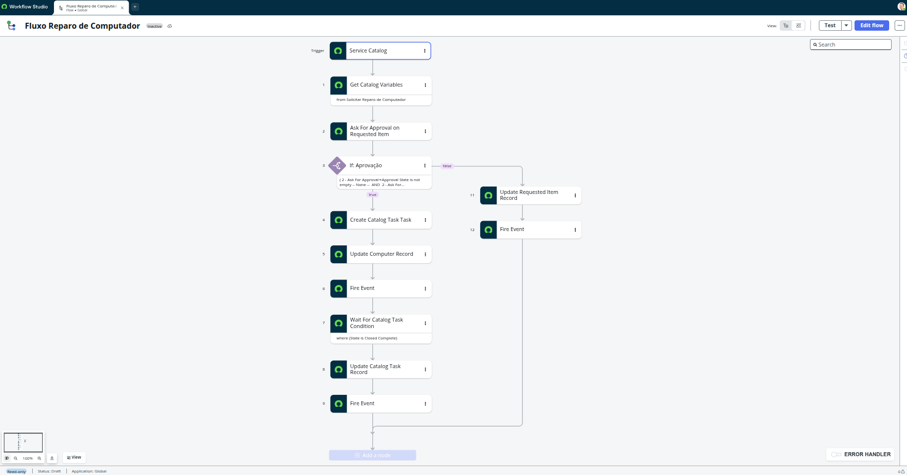

# Fluxo do Processo — Portal de Reparo de Computadores

[← Voltar ao projeto](../README.md)

Passo a passo real do Flow **"Fluxo Reparo de Computador"** (Flow Designer), do pedido no Service Catalog até o encerramento — reconstruído a partir da configuração do flow (evidência em screenshot).

---

## Diagrama



```text
Trigger: Service Catalog (novo RITM)
        │
1. Get Catalog Variables from "Solicitar Reparo de Computador"
        │
2. Ask For Approval on Requested Item ──▶ gestor aprova ou rejeita (RN009, RN010)
        │
3. If: Aprovação?
        │
    ┌───┴────────────────────────┐
   true                        false
    │                            │
4. Create Catalog Task Task     11. Update Requested Item Record
5. Update Computer Record            (RN003 · install_status = In Maintenance)
6. Send Notification [Reparo Confirmado]
7. Wait For Catalog Task Condition (State is Closed Complete)
8. Update Catalog Task Record
9. Send Notification [Reparo Concluído]
                                 12. Send Notification [Rejeitado]
```

---

## Passo a passo

1. **Trigger — Service Catalog:** o flow inicia quando um novo Requested Item (RITM) é criado a partir do Catalog Item "Solicitar Reparo de Computador".

2. **Get Catalog Variables:** o flow lê as variáveis preenchidas no catálogo (equipamento, tipo de problema, urgência, endereço de coleta).

3. **Ask For Approval on Requested Item:** dispara uma aprovação nativa sobre o RITM (`Table: Requested Item [sc_req_item]`), com o motivo _"Solicitação de reparo de computador enviada. Aguardando aprovação."_, usando os campos `Approval` e `Approval history` do RITM. Regra: qualquer aprovador definido decide (RN009 — o Gestor Aprovador é preenchido a partir de `current.caller_id.manager`).

4. **If: Aprovação** — bifurca o fluxo conforme o resultado da aprovação (RN010: uma vez decidido, não é possível reaplicar a ação).

### Ramo "true" — aprovado

- **Passo 5 — Create Catalog Task Task:** cria a Task de TI (`sc_task`) responsável pelo reparo físico.
- **Passo 6 — Update Computer Record:** atualiza o `install_status` do ativo na CMDB (RN003 — In Maintenance, quando a TI recebe o equipamento).
- **Passo 7 — Send Notification [Reparo Confirmado]:** notifica usuário e TI (RN008).
- **Passo 8 — Wait For Catalog Task Condition** `where (State is Closed Complete)`: o flow pausa até a Task de TI ser fechada como concluída — não há encerramento automático por tempo (RN006).
- **Passo 9 — Update Catalog Task Record:** grava em Work notes o resultado do reparo (_"Reparo executado pela equipe de TI."_) e atualiza o status do ativo de volta para In Use (RN005).
- **Passo 10 — Send Notification [Reparo Concluído]:** notifica o usuário que o equipamento foi reparado e está pronto (RN008).

### Ramo "false" — rejeitado

- **Passo 11 — Update Requested Item Record:** encerra a solicitação sem criar Task de TI.
- **Passo 12 — Send Notification [Rejeitado]:** notifica usuário e gestor do encerramento (RN008).

---

## Regras de negócio aplicadas neste flow

| Etapa do flow                      | Regra de negócio                                                                                 |
| ---------------------------------- | ------------------------------------------------------------------------------------------------ |
| Ask For Approval                   | [RN009 — Validação de usuário gestor](regras-negocio.md#rn009--validação-de-usuário-gestor)      |
| If: Aprovação                      | [RN010 — Impedir aprovação duplicada](regras-negocio.md#rn010--impedir-aprovação-duplicada)      |
| Update Computer Record (ramo true) | [RN003 — In Maintenance](regras-negocio.md#rn003--atualização-do-status-do-ativo-in-maintenance) |
| Wait For Catalog Task Condition    | [RN006 — Encerramento do fluxo](regras-negocio.md#rn006--encerramento-do-fluxo)                  |
| Update Catalog Task Record         | [RN005 — In Use](regras-negocio.md#rn005--atualização-do-status-do-ativo-in-use)                 |
| Send Notification (todas as 3)     | [RN008 — Notificações por etapa](regras-negocio.md#rn008--notificações-por-etapa)                |

> RN004 (status In Transit) não aparece como um step isolado neste flow — é aplicada no envio físico do equipamento, fora do escopo direto da automação capturada aqui.

---

## Evidências

| Etapa                                          | Screenshot                                                                                |
| ---------------------------------------------- | ----------------------------------------------------------------------------------------- |
| Configuração do trigger                        | [`21-prc-04-flow-designer-config.png`](../screenshots/21-prc-04-flow-designer-config.png) |
| Ask For Approval (config)                      | [`23-prc-04-approval-pending.png`](../screenshots/23-prc-04-approval-pending.png)         |
| Lógica condicional (If)                        | [`24-prc-04-flow-logic.png`](../screenshots/24-prc-04-flow-logic.png)                     |
| Task de TI criada                              | [`25-prc-04-task-created.png`](../screenshots/25-prc-04-task-created.png)                 |
| Wait For Condition                             | [`26-prc-04-wait-condition.png`](../screenshots/26-prc-04-wait-condition.png)             |
| Update Catalog Task Record + Send Notification | [`27-prc-04-flow-executed.png`](../screenshots/27-prc-04-flow-executed.png)               |
| Diagrama completo (Workflow Studio)            | [`29-prc-04-flow-diagram.png`](../screenshots/29-prc-04-flow-diagram.png)                 |
